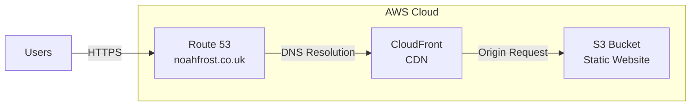

# 🚀 Project 16: Portfolio Infrastructure as Code

Automated CI/CD pipeline and Infrastructure as Code for my DevSecOps portfolio website.

## 🎯 Overview

This project demonstrates production-grade DevSecOps practices by:
- Managing AWS infrastructure with Terraform
- Implementing CI/CD with GitHub Actions
- Automating deployments and cache invalidation
- Following security best practices

## 🏗️ Architecture



The infrastructure consists of:
- **S3 Bucket**: Hosts the static website files
- **CloudFront**: Global CDN for HTTPS and performance
- **Route 53**: DNS management for custom domain


## 🛠️ Technologies

- **Infrastructure**: Terraform
- **Hosting**: AWS S3 Static Website
- **CDN**: AWS CloudFront
- **DNS**: AWS Route 53
- **SSL**: AWS Certificate Manager
- **CI/CD**: GitHub Actions
- **Cost**: ~$0.50/month

## 🚀 The Journey: Manual to Automated

Initially built manually through AWS Console, then realised the pain of manual updates. Solution: Retrofit automation without downtime.

### Bringing Existing Infrastructure Under Terraform Control

After building everything manually in AWS Console, I successfully migrated it to Infrastructure as Code:

1. **Examined AWS Console** - Documented all manually-created resources
2. **Wrote Terraform files** - Created `.tf` files matching the existing infrastructure  
3. **Imported resources** - Used `terraform import` commands to bring each resource under Terraform management
4. **Applied changes** - Ran `terraform apply` to align resources with code

```bash
cd terraform
terraform init

# Imported all existing resources
terraform import aws_s3_bucket.portfolio noahfrost-devsecops
terraform import aws_cloudfront_distribution.portfolio ERS9RIPIBIOR
# ... etc for all resources

# Applied to ensure consistency
terraform apply
```

**Result**: Terraform now fully manages the infrastructure. Any future infrastructure changes go through code, providing version control, audit trails, and repeatability.

### Deploy Updates

Application updates use GitHub Actions:
```bash
git push origin main  # GitHub Actions handles file deployment
```

Infrastructure changes use Terraform:
```bash
terraform plan   # Review changes
terraform apply  # Apply infrastructure updates
```

## 🔒 Security Features

- ✅ HTTPS enforced via CloudFront
- ✅ S3 bucket not directly accessible
- ✅ IAM least privilege principles
- ✅ Secrets stored in GitHub Secrets
- ✅ Infrastructure as Code for auditability

## 📊 Performance

- **Global CDN**: Content served from 400+ edge locations
- **Compression**: Enabled for all text assets
- **Caching**: Optimised TTL settings
- **HTTP/2**: Enabled by default

## 🎯 Key Achievements

- Imported existing AWS infrastructure into Terraform
- Automated deployment pipeline with cache invalidation
- Zero-downtime deployments
- Sub-minute deployment times
- Infrastructure fully documented as code

## 🔄 CI/CD Pipeline

The GitHub Actions workflow:

1. Triggers on push to main
2. Syncs website files to S3
3. Creates CloudFront invalidation
4. Completes in under 60 seconds

## 📝 Lessons Learned

### Real-World Application

This "manual first, automate later" approach mirrors how infrastructure often evolves in companies:
- Dev teams build POCs manually
- Success leads to need for automation
- DevOps retrofits IaC and pipelines
- No downtime during transition

The ability to take existing cloud resources and bring them under Terraform management is a valuable skill for any DevSecOps engineer.

---

Built as part of my DevSecOps portfolio journey - proving that even portfolio sites deserve proper infrastructure!