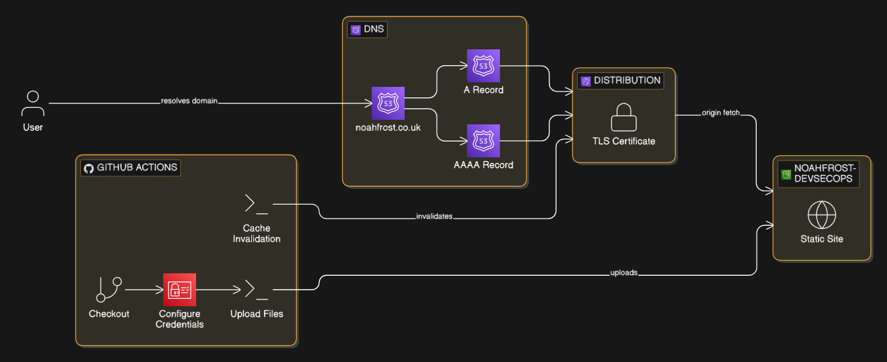
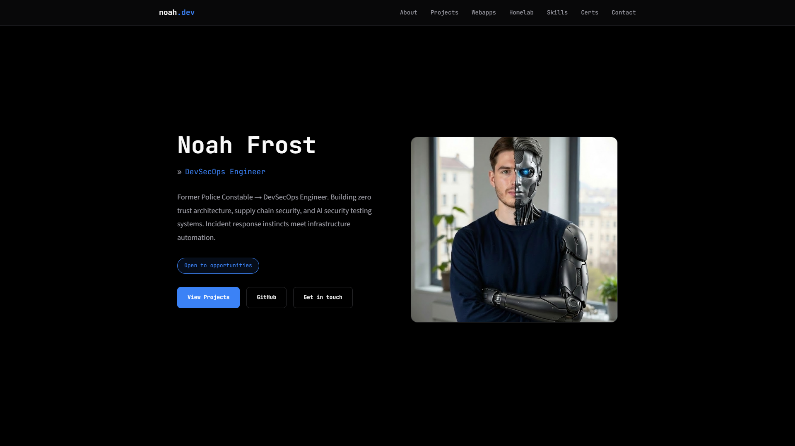

# Portfolio CI CD Pipeline

Automated deployment pipeline that builds, ships, and serves a portfolio website on AWS — a working example of infrastructure-as-code and CI/CD for static site delivery.

## Overview

Every push to `main` triggers a GitHub Actions workflow that syncs site assets to S3 and invalidates the CloudFront cache, delivering updates to a custom domain within minutes. There's no manual upload, no clicking through the AWS console — commit and it's live.

The infrastructure is defined entirely in Terraform: an S3 bucket configured for static website hosting, a CloudFront distribution handling TLS termination and global caching, Route53 DNS records pointing the custom domain to CloudFront, and an ACM certificate for HTTPS. The CI/CD pipeline authenticates via IAM credentials stored in GitHub Secrets and handles both the file sync and cache invalidation in a single workflow run.

This is a deliberately simple project, but it reflects how production static sites are actually delivered — infrastructure defined in code, deployments automated through CI/CD, and DNS/TLS/CDN configured correctly from the start rather than bolted on later.

## Architecture

The request flow runs left to right: DNS resolution through Route53 directs traffic to a CloudFront distribution, which serves cached content from an S3 origin bucket. CloudFront handles TLS termination using an ACM certificate and enforces HTTPS by redirecting all HTTP requests.

The deployment flow runs separately: GitHub Actions checks out the repository, authenticates to AWS, syncs files to S3 (excluding infrastructure and CI/CD config), then invalidates the CloudFront cache so changes propagate globally.

## Tech Stack

**Infrastructure**: AWS S3, CloudFront, Route53, ACM — all provisioned via Terraform

**CI/CD**: GitHub Actions workflow triggered on push to `main`, scoped to content file changes only

**Hosting**: S3 static website hosting with CloudFront CDN and custom domain (noahfrost.co.uk)

## Key Decisions

- **Terraform over ClickOps**: Every AWS resource is defined in code and version-controlled. Infrastructure can be reviewed in PRs, reproduced in other accounts, and torn down cleanly — no console drift.

- **CloudFront custom origin over S3 OAC**: Using the S3 website endpoint as a custom origin rather than a private bucket with Origin Access Control. This keeps the S3 website configuration features (index document routing) while CloudFront handles TLS and caching.

- **Path-scoped workflow triggers**: The GitHub Actions workflow only fires when content files change (`index.html`, images, PDF), not on Terraform or CI/CD config changes. This avoids unnecessary deployments and keeps S3 syncs predictable.

- **Cache invalidation as a deployment step**: Rather than relying on TTL expiry, the pipeline explicitly invalidates CloudFront's cache after every deploy, ensuring visitors see changes within minutes rather than waiting up to 24 hours.

## Screenshots

## Author

**Noah Frost**

- Website: [noahfrost.co.uk](https://noahfrost.co.uk)
- GitHub: [github.com/nfroze](https://github.com/nfroze)
- LinkedIn: [linkedin.com/in/nfroze](https://linkedin.com/in/nfroze)
