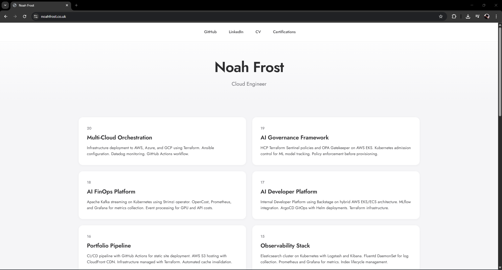

# Portfolio CI/CD Pipeline

Automated deployment pipeline that publishes portfolio updates to a globally distributed CDN within minutes of committing code — the same pattern used by production static sites serving millions of users.

## Overview

This project implements a complete CI/CD pipeline for a static portfolio website. When changes are pushed to the main branch, GitHub Actions automatically syncs files to S3 and invalidates the CloudFront cache, ensuring visitors see the latest content without manual intervention.

The infrastructure follows AWS best practices for static site hosting: S3 for origin storage, CloudFront for global edge caching with HTTPS enforcement, and Route 53 for DNS with both IPv4 and IPv6 support. All infrastructure is defined in Terraform, making the entire stack reproducible and version-controlled.

This approach eliminates the operational overhead of traditional web servers while providing enterprise-grade performance and availability through AWS's global edge network.

## Architecture

Requests flow through the system as follows: users access the custom domain via Route 53, which routes to CloudFront. CloudFront serves cached content from edge locations worldwide, falling back to the S3 origin when cache misses occur. The CI/CD pipeline operates independently — on each push, GitHub Actions uploads changed files to S3 and triggers a cache invalidation to propagate updates globally.

The Terraform configuration manages the S3 bucket with website hosting enabled, CloudFront distribution with custom SSL certificate, and Route 53 hosted zone with A and AAAA alias records pointing to CloudFront.

## Tech Stack

**Infrastructure**: AWS S3, CloudFront, Route 53, ACM (SSL/TLS)  
**CI/CD**: GitHub Actions  
**IaC**: Terraform  
**Frontend**: HTML, CSS, JavaScript

## Key Decisions

- **CloudFront with S3 website endpoint (not S3 REST API)**: Using the S3 website endpoint as a custom origin allows proper handling of index documents and error pages, rather than the more limited S3 REST API origin which doesn't support website hosting features.

- **Path-based cache invalidation on every deploy**: Rather than waiting for TTL expiration or using versioned filenames, the pipeline invalidates `/*` to ensure immediate content updates. For a portfolio site with infrequent updates, the invalidation cost is negligible compared to the complexity of asset versioning.

- **Redirect HTTP to HTTPS at the edge**: CloudFront's `redirect-to-https` viewer protocol policy enforces secure connections without requiring application-level redirects, simplifying the static site while meeting security best practices.

- **Selective file sync with exclusions**: The deploy workflow explicitly excludes infrastructure code, screenshots, and documentation from S3, keeping the production bucket clean and reducing sync time.

## Screenshots

## Author

**Noah Frost**

- Website: [noahfrost.co.uk](https://noahfrost.co.uk)
- GitHub: [github.com/nfroze](https://github.com/nfroze)
- LinkedIn: [linkedin.com/in/nfroze](https://linkedin.com/in/nfroze)